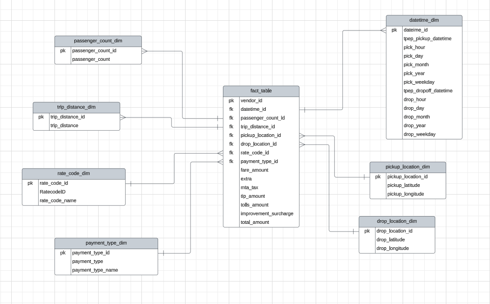

# Uber Data Analytics

## Overview of the analysis
The goal of this project is to perform data analytics on Uber data using various tools and technologies, including Google Cloud Platform (GCP), Python, Compute Instance, Mage Data Pipeline Tool, BigQuery, and Looker Studio. This README provides an overview of the project's architecture, the technology stack, the dataset used, and the data model.

## Technology Used

### Programming Language
- Python

### Google Cloud Platform (GCP)
- Google Storage: For storing and managing data.
- Compute Instance: For running Python scripts and data processing tasks.
- BigQuery: For data analysis and querying.
- Looker Studio: For building interactive dashboards.

### Modern Data Pipeline Tool
- Mage: An open-source data pipeline tool used for data ingestion, transformation, and orchestration. 

### Diagramming and Visualization Tool
- Lucidchart: For creating diagrams (data model).

### Dataset Used
The dataset used for this project is the TLC Trip Record Data, which includes information about yellow and green taxi trips. This dataset captures various fields such as pick-up and drop-off dates/times, locations, trip distances, fares, rate types, payment types, and driver-reported passenger counts. 

For more information about the dataset, you can refer to the following sources:

- NYC TLC Trip Record Data
- Data Dictionary

### Data Model
